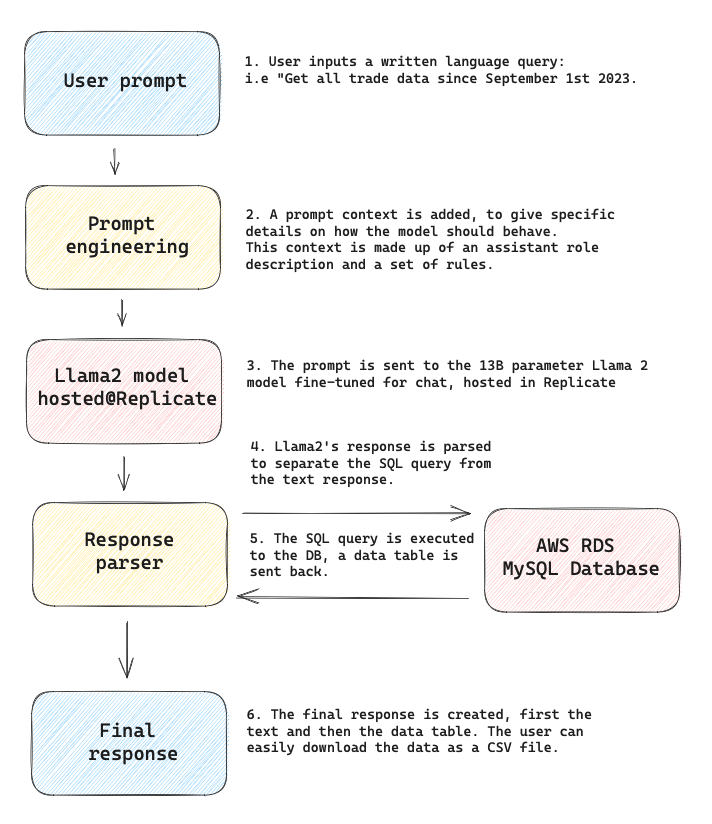

# ark-data-assistant

## Project Overview

---

The objective of this project is to show that LLMs can be turned into simple data assistants by just providing the appropriate context. A role description and a set of rules can give the model the necessary guidance to respond helpfully to data requests.

As a second step to the project, the model can be fine-tuned with a set of question-answer examples to expand the capabilities of the assistant.

## Flow Chart
